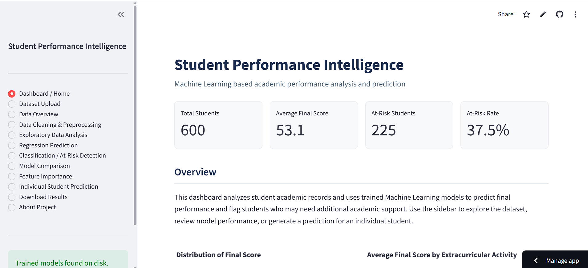
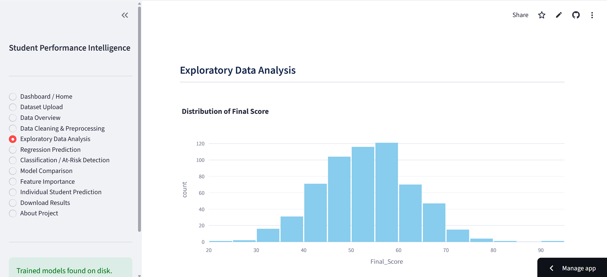
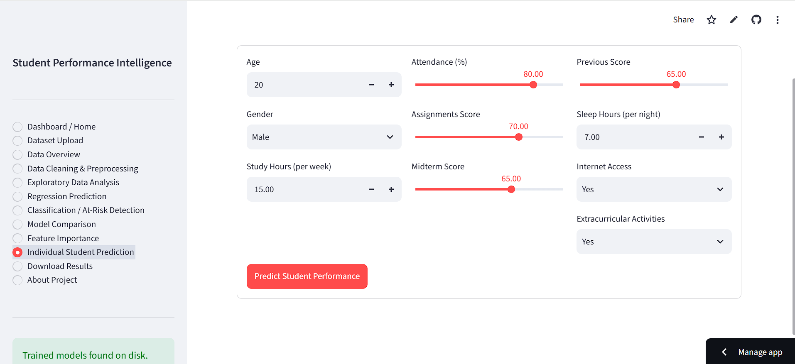
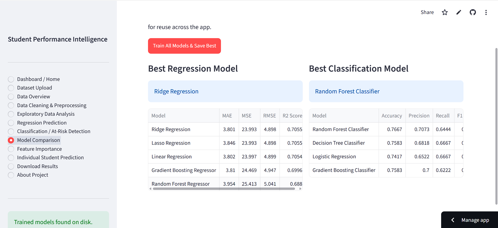

# Student Performance Intelligence & Prediction System

**Machine Learning based academic performance analysis and prediction**

A complete, self-contained Streamlit web application that analyzes student
academic data and uses Machine Learning to predict final academic
performance and identify students who may be academically at risk. Built
as a portfolio-ready project — no paid APIs, no API keys, runs entirely
locally with open-source Python libraries.

---

## Table of Contents

- [Features](#features)
- [Machine Learning Models](#machine-learning-models)
- [Tech Stack](#tech-stack)
- [Dataset](#dataset)
- [Project Architecture](#project-architecture)
- [Installation & Local Setup](#installation--local-setup)
- [Training the Models](#training-the-models)
- [Running the Application](#running-the-application)
- [Using the Application](#using-the-application)
- [Screenshots](#screenshots)
- [Model Evaluation](#model-evaluation)
- [Deployment (Streamlit Cloud)](#deployment-streamlit-cloud)
- [Pushing to GitHub](#pushing-to-github)
- [Future Improvements](#future-improvements)
- [Author](#author)
- [License](#license)

---

## Features

- **Dashboard / Home** — key metrics at a glance (student count, average
  score, at-risk rate)
- **Dataset Upload** — bring your own CSV, with column validation
- **Data Overview** — shape, dtypes, missing values, duplicates, summary stats
- **Data Cleaning & Preprocessing** — duplicate removal, missing value
  handling, categorical standardization, explained step-by-step
- **Exploratory Data Analysis** — interactive Plotly charts (distributions,
  scatter plots with trendlines, group comparisons, correlation heatmap)
- **Regression Prediction** — 5 regression models trained and compared to
  predict `Final_Score`
- **Classification / At-Risk Detection** — 4 classification models trained
  and compared to predict `At_Risk`
- **Model Comparison** — trains everything in one click and persists the
  best model of each type to disk
- **Feature Importance** — recovers true feature names after preprocessing
  and visualizes what drives predictions
- **Individual Student Prediction** — a form-based "what-if" predictor with
  a plain-language, rule-based explanation
- **Download Results** — export predictions for the full dataset as CSV
- **About Project** — technical summary and disclaimer

## Machine Learning Models

**Regression (predicting `Final_Score`):**
1. Linear Regression
2. Ridge Regression
3. Lasso Regression
4. Random Forest Regressor
5. Gradient Boosting Regressor

Evaluated with **MAE, MSE, RMSE, R² Score**. The model with the highest
R² is automatically selected as the "Best Regression Model".

**Classification (predicting `At_Risk`, where `Final_Score < 50` = At Risk):**
1. Logistic Regression
2. Decision Tree Classifier
3. Random Forest Classifier
4. Gradient Boosting Classifier

Evaluated with **Accuracy, Precision, Recall, F1 Score, Confusion Matrix**.
The model with the highest F1 score is automatically selected as the
"Best Classification Model".

## Tech Stack

- Python 3.11+
- Streamlit — web application framework
- Pandas / NumPy — data manipulation
- Scikit-learn — preprocessing pipelines and ML models
- Plotly — interactive charts
- Matplotlib / Seaborn — available for static plotting needs
- Joblib — model persistence

No external or paid APIs are used anywhere in this project.

## Dataset

`data/student_performance.csv` contains 600 synthetic but statistically
realistic student records. See [`data/README.md`](data/README.md) for the
full column dictionary and an explanation of how `Final_Score` was
constructed from the other features (not random noise — genuine, learnable
relationships). Regenerate it anytime with:

```bash
python generate_dataset.py
machine-learning
python
scikit-learn
streamlit
pandas
data-science
machine-learning-project
student-performance
data-analysis
portfolio-project
```

## Project Architecture

```
student-performance-ml/
│
├── app.py                     # Streamlit application (all UI pages)
├── train_models.py            # Standalone script: trains & saves best models
├── generate_dataset.py        # Generates the synthetic sample dataset
├── requirements.txt
├── README.md
├── .gitignore
├── LICENSE
│
├── data/
│   ├── student_performance.csv
│   └── README.md
│
├── models/
│   ├── .gitkeep
│   ├── best_regression_model.pkl       (generated)
│   ├── best_classification_model.pkl   (generated)
│   └── metadata.pkl                    (generated)
│
├── src/
│   ├── __init__.py
│   ├── preprocessing.py       # Shared ColumnTransformer pipeline, validation
│   ├── regression.py          # Regression model training & evaluation
│   ├── classification.py      # Classification model training & evaluation
│   ├── visualization.py       # Plotly chart builders
│   └── utils.py                # Prediction helpers, model save/load
│
└── assets/
    └── README.md               # Placeholder for screenshots
```

A single `ColumnTransformer` (built in `src/preprocessing.py`) is shared
by **every** model — numerical features are median-imputed and scaled,
categorical features are most-frequent-imputed and one-hot encoded. This
avoids duplicating preprocessing logic per model and keeps train/serve
behavior consistent.

## Installation & Local Setup

**1. Clone or extract the project**

```bash
git clone https://github.com/<your-username>/student-performance-ml.git
cd student-performance-ml
```

**2. Create a virtual environment**

```bash
python -m venv venv
```

**3. Activate the virtual environment**

Windows (PowerShell / CMD):
```bash
venv\Scripts\activate
```

macOS / Linux:
```bash
source venv/bin/activate
```

**4. Install dependencies**

```bash
pip install -r requirements.txt
```

## Training the Models

The app can train models interactively from the "Model Comparison" page,
but you can also train and save them from the command line before your
first run:

```bash
python train_models.py
```

This will:
- Load `data/student_performance.csv`
- Clean it (remove duplicates, standardize categories)
- Train all 5 regression models and all 4 classification models
- Print a comparison table for each
- Save the best regression model, best classification model, and metadata
  to `models/` using `joblib`

## Running the Application

```bash
streamlit run app.py
```

Then open the local URL Streamlit prints in your terminal — typically:

```
http://localhost:8501
```

## Using the Application

1. Start on the **Dashboard** for a quick summary of the active dataset.
2. Optionally upload your own CSV in **Dataset Upload** (must contain the
   required columns — see `data/README.md`).
3. Explore **Data Overview**, **Data Cleaning & Preprocessing**, and
   **Exploratory Data Analysis** to understand the data.
4. Visit **Model Comparison** and click **"Train All Models & Save Best"**
   (or run `train_models.py` beforehand) — this saves models to disk.
5. Review **Feature Importance** to see which factors drive predictions.
6. Use **Individual Student Prediction** to enter a hypothetical student's
   details and get a predicted score, risk status, and category.
7. Use **Download Results** to export predictions for the entire dataset.


## Screenshots

### Dashboard


### Exploratory Data Analysis


### Student Prediction


### Model Comparison



## Model Evaluation

- **Regression** metrics (MAE, MSE, RMSE, R²) quantify how close predicted
  `Final_Score` values are to actual values — lower MAE/RMSE and higher R²
  indicate a better fit.
- **Classification** metrics (Accuracy, Precision, Recall, F1) quantify how
  well the model separates "At Risk" from "Not At Risk" students. F1 score
  is used for model selection since it balances precision and recall, which
  matters when at-risk students are a minority class.
- Both comparisons are recomputed live from a held-out test split
  (80/20, fixed random seed) each time you retrain, so results are
  reproducible.

## Deployment (Streamlit Cloud)

1. Push this project to a public (or private) GitHub repository (see
   below).
2. Go to [share.streamlit.io](https://share.streamlit.io) and sign in with
   GitHub.
3. Click **"New app"**, select your repository, branch, and set the main
   file path to `app.py`.
4. Streamlit Cloud will automatically install dependencies from
   `requirements.txt`.
5. Click **Deploy**. Once live, open the app and, on first load, go to
   **Model Comparison → Train All Models & Save Best** to generate model
   files in the cloud environment (or commit pre-trained `.pkl` files if
   you'd rather skip that step — just remove the `models/*.pkl` line from
   `.gitignore` first).
6. No secrets or API keys are required for this app.

## Pushing to GitHub

```bash
git init
git add .
git commit -m "Initial commit: Student Performance Intelligence system"
git branch -M main
git remote add origin https://github.com/<your-username>/student-performance-ml.git
git push -u origin main
```

## Future Improvements

1. Add cross-validation and hyperparameter tuning (e.g. `GridSearchCV`)
   for each candidate model instead of fixed default hyperparameters.
2. Support multi-class performance prediction (predict the performance
   category directly) alongside the existing regression/classification
   tasks.
3. Add authentication and per-user dataset storage for multi-user
   deployments.
4. Track experiment history (model versions, metrics over time) with a
   lightweight experiment tracker.
5. Add SHAP-based explanations for individual predictions instead of the
   current rule-based explanation, for deeper model interpretability.

## Author

Built as a Machine Learning portfolio project. Feel free to fork, adapt,
and extend it for your own coursework, CV, or internship applications.

## License

This project is licensed under the [MIT License](LICENSE).

---

Built with Python, Scikit-learn and Streamlit
